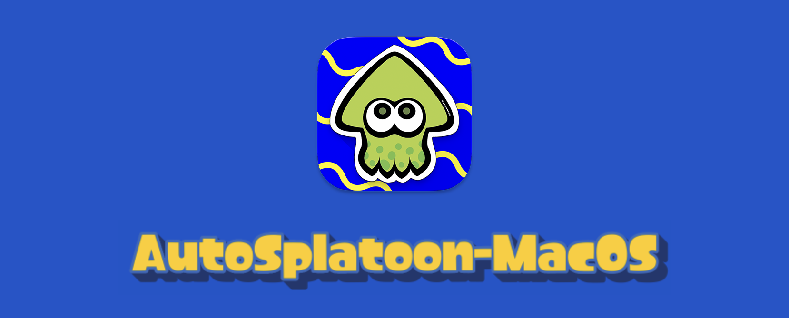
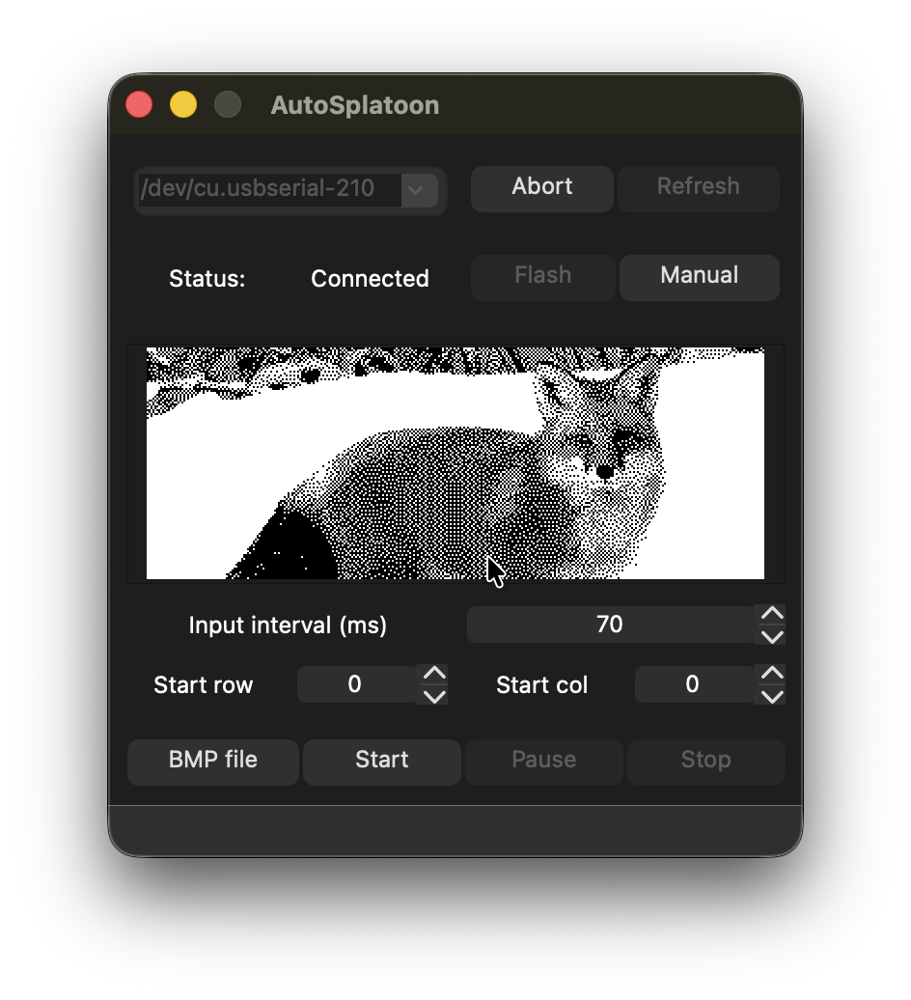
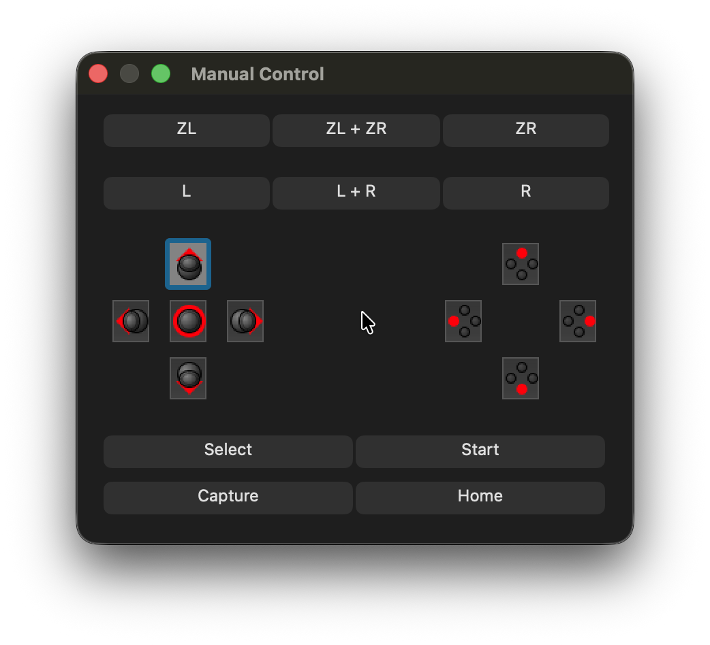

# AutoSplatoon for macOS

> **Note:** This is a macOS port of the original [AutoSplatoon by jiangotto](https://github.com/jiangotto/AutoSplatoon). 

This tool allows you to take an image from your computer and automatically draw it in Splatoon series to post in-game.

I created this port because I couldn't bring my Desktop PC with me to the other side of the world. This was my first Qt project, put together hastily in about 3-4 hours. If you find any bugs or have problems, please **report them in the 'Issues' tab!** 

If my instructions are not detailed enough, I will make a video tutorial for you.

## Requirements

* A Mac (of course).
* A Nintendo Switch with Splatoon games.
* An **ESP32-WROOM** development board. You can get these easily on AliExpress. [This one looks fine](https://www.aliexpress.com/item/1005010182900541.html) (Full disclosure: I haven't bought from this specific seller, but it should work).

## How to Use

1.  In Splatoon 3, go to the red postbox in the main square and open the drawing interface.
2.  Select the **smallest brush size**.
3.  Use the joystick to move the drawing cursor to the **top-left corner** of the canvas.
4.  Press the **Home** button on your controller. Navigate to the **Controllers** menu, then select **"Change Grip/Order"**.
5.  Open the `AutoSplatoon.app` on your Mac.
6.  Plug your ESP32 board into your Mac via USB.
7.  In the app's dropdown menu, find and select your ESP32 board.
    * **Important:** Make sure to select the port name that starts with **`/dev/cu.`** (not `/dev/tty.`).
8.  Click **"Connect"**.
    * **If this is your first time:** You *must* click the **"Flash"** button first to write the firmware to the board. After flashing is successful, click "Connect".
9.  Once the status says "Connected", use the **"Manual"** control buttons *in the app* to navigate back into the game and the drawing interface.
    * **CRITICAL: Do NOT touch any other controllers or the Switch's touchscreen from this point on.**
10. Click **"BMP file"** in the app and select your 2-color (monochrome) 320 * 120 BMP file.
11. Set your drawing parameters (default is 70ms, but I find 55ms works best of me).
12. Place your ESP32 board near your Switch and **make sure your Switch is plugged into its power adapter**. (This prevents it from entering sleep mode. If it sleeps, the network will disconnect and your drawing will be lost!)
13. Click **"Start"** and let it draw!
14. Wait.
15. Wait, but patiently
16. When the drawing process is done, it will automatically save and exit. You can check and post it at anytime.

P.S. Make sure your internet connection remains stable throughout the process.
